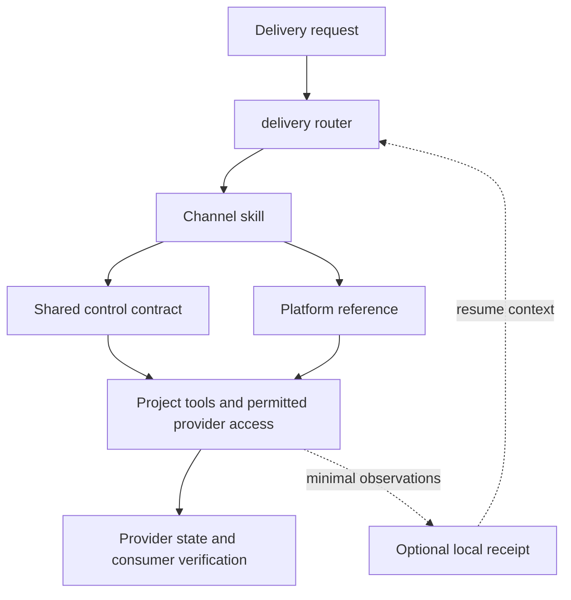

# How Delivery works

Delivery is a set of instructions that an agent follows with the tools already
available to it. It has no provider runtime, remote service, or background
worker. The optional Python helper manages local receipts.

## One contract, provider-specific meaning

The [control contract](../references/delivery-control-contract.md) defines what
must stay bound through a delivery: provider, account, target, artifact digest,
material metadata, requested effect, audience, visibility, and schedule where
relevant. A changed artifact or audience can invalidate an earlier decision.

Channel skills interpret the contract for a specific destination. For example,
a Play testing track, a YouTube private upload, and a website revision receiving
no production traffic are different kinds of staging. Their provider state and
consumer checks remain distinct.

| Requested effect | Evidence the agent needs |
| --- | --- |
| `prepare` | The exact artifact and delivery intent are ready. |
| `stage` | The matching provider object exists in the intended draft, private, internal, or test state. |
| `submit` | The provider reports the exact object submitted for review or certification. |
| `release` | The provider reports the authorized distribution or scheduling effect. |
| `verify` | The requested provider or consumer surface has been checked without mutation. |

These are requested outcomes, not an executable state machine. Not every
channel traverses every phase, and a later phase is never inferred from a
successful local command.

## Provider tools remain outside the package

The agent first inspects the project's existing release workflow. It then uses
available official tools or a permitted official UI when needed. Choosing a
route requires checking actual availability and provider semantics; a command
name in a reference does not mean that tool is installed.

Delivery does not supply adapters, authenticated sessions, paid services, or a
universal publishing API. Any tool that writes to a provider operates under
the host's permissions and the user's authorization. Agent instructions are
not a security sandbox.

## Recovery starts with observation

If an upload, submission, or deployment returns an uncertain result, the agent
preserves `effect_unknown` and looks up the same provider object. A timeout
does not prove that the request failed. Switching writers or retrying first
could create a duplicate or commit a second effect.

An optional receipt stores enough context to resume: hashes, nonsensitive
identifiers, timestamped observations, and the next recoverable action. It is
neither a provider state cache with authority nor a durable execution lock for
remote writes. Provider evidence takes precedence over a receipt.

## What the package checks establish

The package validator checks local distribution structure and consistency.
Unit tests exercise receipt behavior, including input validation and artifact
binding. The synthetic demo shows those boundaries with fictional data.

Those checks do not establish a successful provider sign-in, submission,
review, rollout, installation, or end-user experience. A real delivery needs
its own evidence on the requested provider and consumer surfaces.
